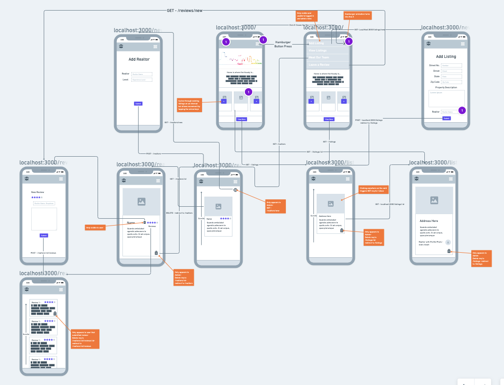

# Stribling Real Estate

### Click [here](https://stribling-real-estate.herokuapp.com/) to see the finished product!

## About the creation:
I started this project with the intention of building a website for our burgeoning real estate business. There is huge potential for the features and I am looking forward to working on this for a very long time into the future.

## Technologies Used

### Credits
[Popper](https://popper.js.org/)

### Original WireFrame:

### Public Trello Board:
[Trello](https://trello.com/b/BcviQqph/stribling-real-estate)

### Icebox Items:
- [ ] Desktop Styling
- [ ] More data about houses listing, i.e.(list price, beds/baths etc.)- potentially pull API data for this depending on cost
- [ ] Expose API of houses listed for others to pull from
- [ ] create "guest", "potential", "renter" roles with differing features and access
- [ ] vendor access to submit invoices to accounts payable and includes notifications and plugins for other well known websites like AirBnB/Vrbo
- [ ] realtor access to track leads
- [ ] admin feature to regulate lead flow and process applications
- [ ] application feature for "potentials" seeking housing
- [ ] pdf,word document upload and download for many other roles
- [ ] preferred vendor list
- [ ] recommended sites and destinations localized to listing
- [ ] walkability score API integration
- [ ] school rating score API integration
- [ ] text/email notifications for vendors/renters/potentials

